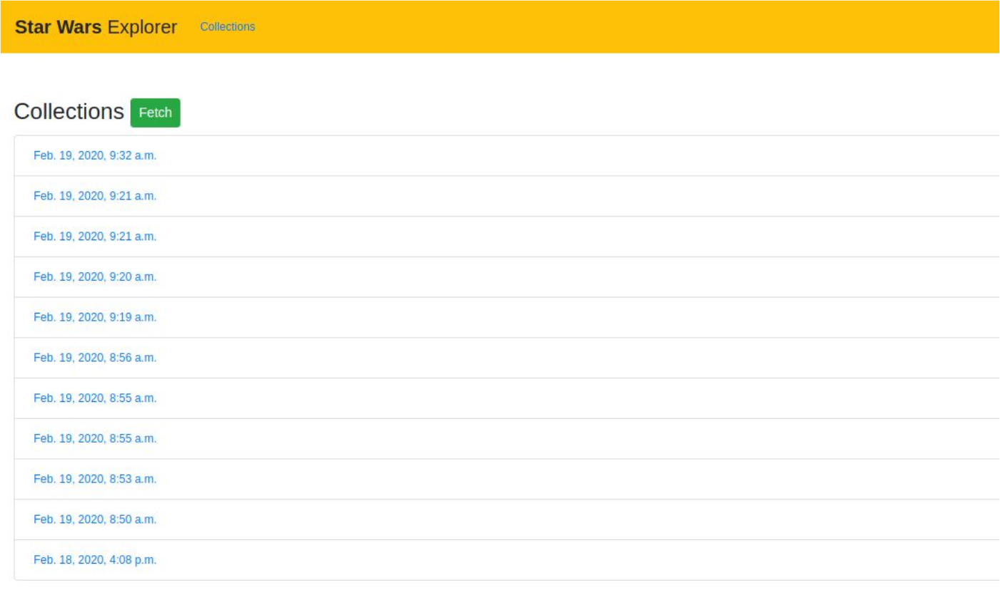
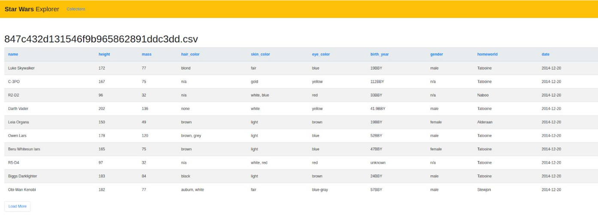
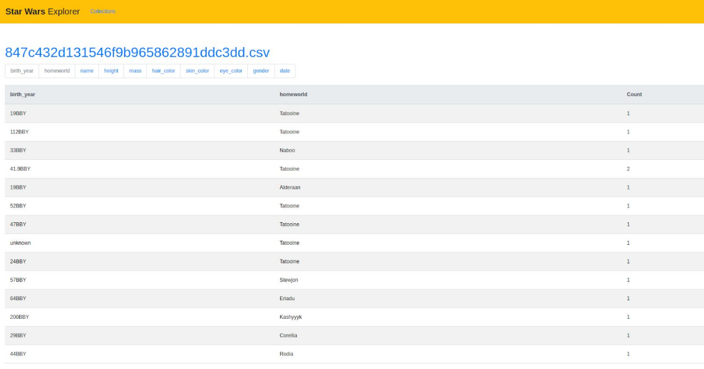

My task:

# Adverity {Junior,Mid,Senior} Python Developer Challenge

Hi! It's nice to see you here and all the best of luck solving the challenge!
It's based on a simplified version of one of the day-to-day tasks we encounter at Adverity. 

To make the coding more pleasant for you, we've taken care of the basic app bootstrap, please see `docker-compose.yaml` for details.
Things you should know about this template:
- `src` is the root directory of the Django project
- you will need to add additional libraries to complete the challenge, but the use of Django and petl is obligatory
- feel free to modify the compose file so it suits your needs (if needed)
- js and css static files are stored in the `static` directory 
- templates are stored in the `templates` directory. To make things simpler, you're provided with a base template, but you're encouraged to tweak anything you like

We're interested in a clean solution for the problems described in the requirements list below. Besides that, we'd be looking at your whole approach to applications development: performance, code and file structure.

Depending on your seniority level, we assume this task will take you between 4 and 8 hours. Do not hesitate to prioritize functionality and/or adjust the complexity of your solution. We expect you to cover all the requirements. If you exceed the amount of time you were planning to spend on this assignment, and you don't want to continue, just leave some comments to illustrate what still needs to be done.

We'd ask you to complete the challenge within 14 days. Should that not work for you (vacation/workload/other obligations - life happens, right?), please inform our recruiter, and we'll find a tailor-made solution.

## Running the app

If you're a junior, chances are some of these concepts are new for you. The setup works as-is and does not require any additional knowledge on your side, other than being able to handle Makefile, Docker and docker-compose. We use them at work a lot, so we've decided to make them part of the challenge as well. If you use compose version 3, feel free to drop the dash from the Makefile. It's your Makefile now, adjust it as you need, but we want to be able to evaluate whether the assignment works by running `make up`.

`make up` will build and start the project. Visit http://localhost:8000 in your browser. The migrations are run automatically.

Once the app is running, you can use bash from the container by running `make bash`. You can then create new Django apps, migrations, install Python packages etc.

`make down` removes the docker containers, images and volumes from the host.

## What will be evaluated

Before we start evaluating your assessment, all the requirements from the `Objective` section need to be met. Once that's done, we will evaluate:
- knowledge of the basic OOP principles, separation of concerns, DRY, KISS
- your ability to write meaningful tests
- how resource-consuming this solution is, try to keep the memory footprint as small as possible
- your familiarity with Django
- adhering to PEP8

## What won't get you extra points

There are plenty of tools that we use at work to keep our code nice and tidy, but it's just an assessment to evaluate 
 your coding and problem-solving skills. That's why there's no extra points for:
- using pip-tools, poetry, pyproject
- pre-commit hooks
- finishing this assignment ASAP
- styling - screenshot examples are just examples. Things such as colors or padding will not be evaluated

---

## Objective

Build a simple app which allows you to collect, resolve and inspect information about characters in the Star Wars universe from the [SWAPI](https://swapi.dev/documentation). 

The entry endpoint for data retrieval is: https://swapi.dev/api/people

The requirements listed below are presented from the perspective of an end-user, similarly to the user stories in Agile.

### Requirement #1 - Data retrieval and storage 

As a user, I want to download the latest complete dataset of Star Wars characters using the API by clicking on a button, and have the data stored as a CSV file in my file system

The Definition of Done:
- the dataset metadata is stored in the database (the filename and the date of the download)
- the dataset is listed in the UI
- no unnecessary fetches are made

Example UI

### Requirement #2 - Data transformation

As a user, I want the data to be cleaned and preprocessed before it's saved in my filesystem. I want specific columns to be altered, dropped or created.

The Definition of Done:
- Add: `date` column in the format of `%Y-%m-%d` and is based on `edited`
- Alter: the `homeworld` planet is resolved into its name, eg. /planets/1/ -> Tatooine
- Drop: fields `films`, `species`, `vehicles`, `starships`, `created`, `edited` can be dropped
- no unnecessary fetches are made

### Requirement #3 - Data representation 

As a user, I want to be able to inspect all previously downloaded datasets.

The Definition of Done:
- clicking the dataset name in the UI shows the data from the dataset
- the table should only show the first 10 rows of the dataset
- by clicking on a button “Load more” additional 10 rows should be shown

Example UI

### Requirement #4 - Data aggregation

As a user, I want to be able to count the occurrences of values or combinations of values for specific columns, so that I can better understand the frequency and distribution of the data in those columns. The app should provide a table that shows the counts of each value or combination of values for the selected columns.

The Definition of Done:
- the user can count the occurrences of values for any combination of selected columns

Example UI after selecting `birth_year` and `homeworld` columns

